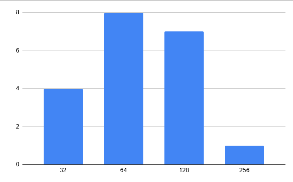

# 2048AI
Created a python script that uses two different algorithms (random and search algorithm) to play [2048](https://play2048.co/). Utilizes pyautogui to read information on the user's screen which in turn populates the graph held for the algorithm. The algorithm then dicates the best possible move and uses pyautogui control of the keyboard to execute the best possible move.
## Creation + Implementation
Translated the javascript code found at https://sleepycoder.github.io/2048/ai.js to python for the AI algorithm. Then added main and two functions, 'smartAI' and 'randomAI'.
### Algorithm / AI Class
- __init__
  - initalizes members of the class
    - next: indicates which move to make based on what would yield the best future
    - grid: array to keep track of the numbers in each grid
    - node: how many changes has occured
    - MAXDEPTH: how deep the search algorithm can go in terms of looking ahead in the future (LDFS: limited depth first search)
- moveLeft
  - returns the state of the board if all blocks are shifted to the left. Accounts that blocks that are equal and collide into one another combine themselves and is the result of their addition
  - returns board after a left move occurs and the resulting score
- rotate
  - shifts all nodes 90 degrees clockwise
- estimate
  - estimate the state after MAXDEPTH movements
  - estimation score will be punished by the differences of adjacent tiles. So states with high estimation scores usually put the biggest tile at one of the four corners because the number of adjacent tiles is mimimum if at corner, and put other big tiles at the edge of the board and adjacent to a bigger tile
- search
  - finds the direction for each movement on which the game can get the maximal expected score. It’s expected score because a new tile can appear at any empty slot with the same possibility, and has 90% chance to be 2 and 10% to be 4
  - checks out of all possible states, which one yields the best possible score
  - uses LDFS to search each subset of states at each level and then picks the best move off of those potential states
- setTile
  - sets a certain position in the 4x4 grid to a specifc value
- startSearch
  - starts to find the next best move given the current state of the board
### Main
- Opens up a new instance of 
- Zooms out on the tab so the entire game board can be seen
- Get the placement of the game box
- Runs giveen algorithm choice and times how long it takes
- Resets the tab by zooming back in after the game finishes
### SmartAI
- searches the game grid for the position of each block and adds them to the current game board
  - this causes a great slowdown in computation
- based on the result of startsearch, executes the next move based on the best possible move
### RandomAI
This algorithm randomly picks one of the four moves to make and does the corresponding move to go onto the next state. This continues until it can no longer make any more possible moves. From a sample size of 20 trials, the average score achieved is 963 and taking an average of 58 seconds to reach a dead end. Below is a graph for the distrubution of the max tile achieved from each trial. 

## Instructions
- Run the python script. Before running, you can either choose to use the smart algorithm or random algorithm (smart on by default)
  - This script will open up a new instance of the [2048](https://play2048.co/) game
  - Make sure that that the board is set to a new game and the page isn't zoomed out
  - Don't move away from the 2048 tab since the program utilizes keyboard output to control the game
  - AI will continue to make moves until it reaches 2048 or there are no move possible moves (game over)
## Libraries
- pip install pyautogui
- pip install opencv-python
## Credits
- https://sleepycoder.github.io/2014/04/01/2048-ai/
- https://sleepycoder.github.io/2048/ai.js
